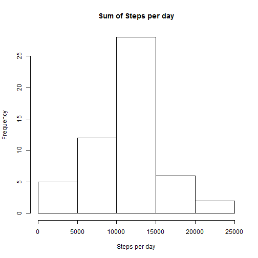
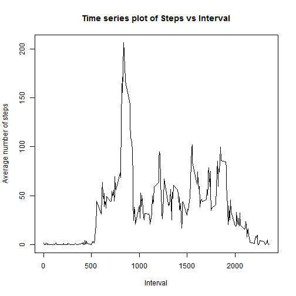
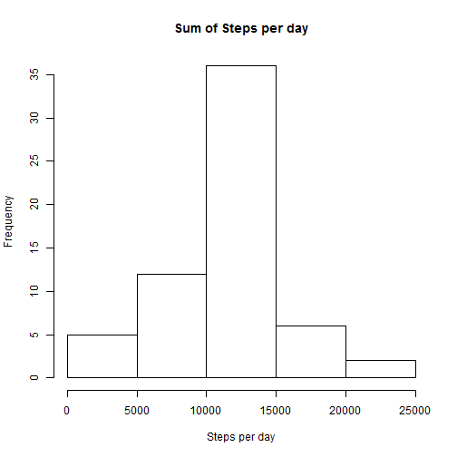

This is an R Markdown document created for the assignment which uses the data from a personal activity monitoring device. The data collected here is the number of steps taken by the individual every 5 minutes measured for 2 months. 

The variables included in this dataset are:
- steps: Number of steps taking in a 5-minute interval (missing values are
coded as NA)
- date: The date on which the measurement was taken in YYYY-MM-DD
format
- interval: Identifier for the 5-minute interval in which measurement was
taken

The assignment is divided into several sections and each section answers a certain question related to the data.

- Loading the data and processing it : 


```r
unzip(zipfile = "activity.zip")
data1<-read.csv("activity.csv")
```
- What is mean total number of steps taken per day?

For this part of the assignment, you can ignore the missing values in the dataset.

1. Make a histogram of the total number of steps taken each day
2. Calculate and report the mean and median total number of steps taken
per day


```r
activity_naomit<-na.omit(data1)

##Determine the total sum of total number of steps each day and make a plot


activitysum<-aggregate.data.frame(x = activity_naomit$steps, by = list(activity_naomit$date),FUN = sum)
activitysum$Group.1<-as.Date(activitysum$Group.1)
activitysum$x<-as.numeric(activitysum$x)

hist(activitysum$x,xlab = "Steps per day",main = "Sum of Steps per day")
```

 

```r
##Calculate the mean and median of number of steps taken per day

stepsmean<-mean(activitysum$x)
stepsmedian<-median(activitysum$x)

"The mean and median of number of steps taken per day are"
```

```
## [1] "The mean and median of number of steps taken per day are"
```

```r
stepsmean
```

```
## [1] 10766
```

```r
stepsmedian
```

```
## [1] 10765
```

- What is the average daily activity pattern?

1. Make a time series plot (i.e. type = "l") of the 5-minute interval (x-axis) and the average number of steps taken, averaged across all days (y-axis)
2. Which 5-minute interval, on average across all the days in the dataset,
contains the maximum number of steps?


```r
##Make a time series plot of the 5 minute interval and the average number of steps taken, averaged across all days

activityintervalmean<-aggregate.data.frame(x = activity_naomit$steps, by = list(activity_naomit$interval),FUN = mean)

##plot it as a time series plot


plot(x = activityintervalmean$Group.1,y = activityintervalmean$x, type = 'l', xlab = "Interval", ylab= "Average number of steps", main = "Time series plot of Steps vs Interval")
```

 

```r
"Time interval with maximum average number of mean steps"
```

```
## [1] "Time interval with maximum average number of mean steps"
```

```r
maxmeansteps <- max(activityintervalmean$x)
int_max <- activityintervalmean$Group.1[match(maxmeansteps,activityintervalmean$x)]

int_max
```

```
## [1] 835
```

- Imputing missing values

Note that there are a number of days/intervals where there are missing values (coded as NA). The presence of missing days may introduce bias into some calculations or summaries of the data.

1. Calculate and report the total number of missing values in the dataset
(i.e. the total number of rows with NAs)
2. Devise a strategy for filling in all of the missing values in the dataset. The strategy does not need to be sophisticated. For example, you could use the mean/median for that day, or the mean for that 5-minute interval, etc.
3. Create a new dataset that is equal to the original dataset but with the
missing data filled in.
4. Make a histogram of the total number of steps taken each day and Calculate and report the mean and median total number of steps taken per day. 

Do these values differ from the estimates from the first part of the assignment? 

Answer :
Yes they do but not to a significant level.

What is the impact of imputing missing data on the estimates of the total daily number of steps?

Answer :
We can see a minor impact in the histogram. The impact greatly affects in region between 10000 to 15000 steps. 


```r
##Total number of missing values

missingvalues<-sum(is.na(data1))
"Total number of missing values"
```

```
## [1] "Total number of missing values"
```

```r
missingvalues
```

```
## [1] 2304
```


```r
##Impute the missing values with the average of the time interval value obtained previously
library(Hmisc)
data2<-data1
data2$nanewval <- rep(activityintervalmean$x, 61)
subset <- subset(data2, is.na(steps)== TRUE)
subset$steps <- impute(subset$steps,subset$nanewval)
data2$steps <- impute(data2$steps, subset$steps)
```


```r
##Draw a histogram of number of steps taken during each day
factivitysum<-aggregate.data.frame(x = data2$steps, by = list(data2$date),FUN = sum)
factivitysum$Group.1<-as.Date(factivitysum$Group.1)
factivitysum$x<-as.numeric(factivitysum$x)

hist(factivitysum$x,xlab = "Steps per day",main = "Sum of Steps per day")
```

 

```r
##Calculate the mean and median of total number of steps taken per day
fstepsmean<-mean(factivitysum$x)
fstepsmedian<-median(factivitysum$x)

"the mean and median of total number of steps taken per day"
```

```
## [1] "the mean and median of total number of steps taken per day"
```

```r
fstepsmean
```

```
## [1] 10766
```

```r
fstepsmedian
```

```
## [1] 10766
```

- Are there differences in activity patterns between weekdays and weekends?

1. Create a new factor variable in the dataset with two levels - "weekday"
and "weekend" indicating whether a given date is a weekday or weekend
day.
2. Make a panel plot containing a time series plot (i.e. type = "l") of the
5-minute interval (x-axis) and the average number of steps taken, averaged
across all weekday days or weekend days (y-axis).


```r
##Seperate the data into weekdays and weekends by forming a new vector called "daylevel"
data2$date<-as.Date(data2$date)
data2$steps<-as.numeric(data2$steps)
data2$dayl = factor(weekdays(data2$date),levels=c("Monday","Tuesday","Wednesday","Thursday","Friday","Saturday","Sunday"))
data2$dayl=as.numeric(data2$dayl)

for(i in 1:17568){
    if(data2$dayl[i]<6){
        data2$daylevel[i]="weekday"}
    else{data2$daylevel[i]="weekend"}
}

weekend<-subset(data2,data2$daylevel=="weekend")
weekday<-subset(data2,data2$daylevel=="weekday")

##Determine the average steps taken per interval for both weekdays and weekends
##Compare the two plots
weekendmean<-aggregate.data.frame(x = weekend$steps, by = list(weekend$interval),FUN = mean)
weekdaymean<-aggregate.data.frame(x = weekday$steps, by = list(weekday$interval),FUN = mean)
```

```r
par(mfrow=c(3,1)) 
plot(x = weekdaymean$Group.1, y = weekdaymean$x, type = 'l', xlab = "Interval", ylab= "Average number of steps", main = "Steps vs Interval for weekdays")
plot(x = weekendmean$Group.1, y = weekendmean$x, type = 'l', xlab = "Interval", ylab= "Average number of steps", main = "Steps vs Interval for weekends")
```

 

Answer: The plot shows that there are more number of steps taken in the weekend. 
